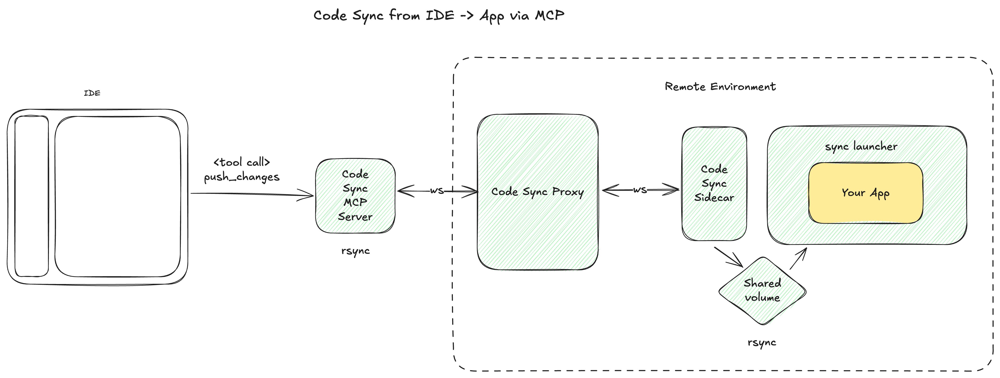
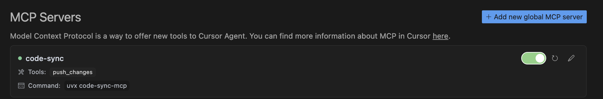
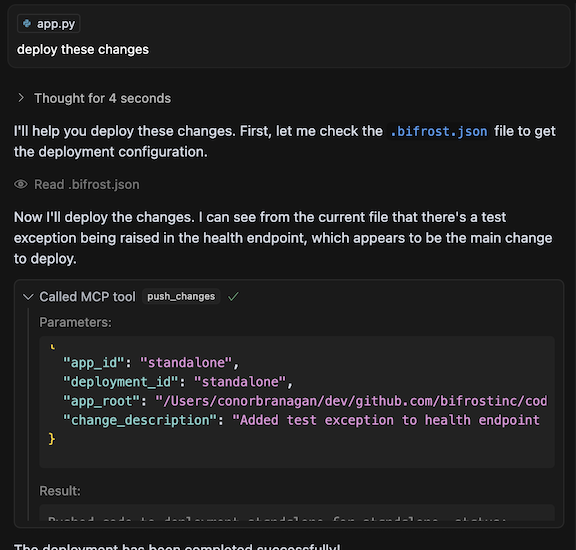

# Code Sync MCP Server

**Hot reload your remote containerized Python applications directly from your IDE using MCP (Model Context Protocol).**

The Code Sync MCP architecture bridges the gap between local development and remote containers for interpreted languages - Python, Ruby, or other interpreted code in your local editor and instantly see changes reflected in containers running anywhere (staging, development clusters, cloud environments, or even production). No compilation step needed - changes take effect immediately.

## What It Does

- **Instant remote sync**: Changes in your local editor appear immediately in containers running anywhere
- **Multi-environment support**: Each developer can target their own remote environment
- **Minimal container changes**: Just wrap your existing entrypoint—no Dockerfile rewrites needed
- **IDE integration**: Works through MCP tools in editors like Cursor
- **Secure remote access**: API key authentication for production-safe remote connections

## Demo

The included [docker-compose.yaml](./docker-compose.yml) runs everything locally with a demo app.

<video src="https://github.com/user-attachments/assets/eb6c267d-16c5-435f-9179-be13aad13456" width="100"></video>

_This demo shows introducing a bug in a health check, seeing it break immediately, then fixing it in real-time._

## How It Works

When you make a code change in your editor:

1. **MCP tool call** triggers from your editor (e.g., Cursor)
2. **Local rsync** generates a patch of your changes
3. **Remote Proxy** (running in your cloud/staging environment) receives the patch and routes to the appropriate deployment
4. **Sidecar** (running alongside your app container) applies changes to a shared volume
5. **Your remote app** gets restarted automatically with the new code



_All components except the MCP server run in your remote environment_

## Setup Guide

### Prerequisites

- Remote Docker/container environment (Kubernetes, Docker Swarm, cloud instances, etc.)
- Local editor with MCP support (like Cursor)
- An API key for securing remote connections

### 1. Deploy the Proxy to your remote environment

The proxy is a central websocket server that routes code changes to the right containers.

**Deploy [code-sync-proxy](./code-sync-proxy)** with:

```bash
PROXY_API_KEY=your-secret-key-here
```

You only need **one proxy** per remote environment for all your applications and developers.

### 2. Configure Your Remote Application (Per App/Deployment)

For each app deployment, you need two changes:

#### A) Modify your container entrypoint

Replace your existing entrypoint with this wrapper that waits for the sync system:

```bash
# Simple one-liner approach (recommended)
sh -c "while [ ! -f /app-files/.sidecar/rsync-launcher.sh ]; do echo 'Waiting for sync...'; sleep 1; done && /app-files/.sidecar/rsync-launcher.sh 'YOUR_ORIGINAL_COMMAND_HERE'"
```

Or use the [provided script template](./demo-app/code-sync-entrypoint.sh).

#### B) Add the sidecar container to your remote deployment

Deploy [code-sync-sidecar](https://hub.docker.com/r/bifrostinc/code-sync-sidecar) container alongside your app with these environment variables:

```bash
BIFROST_API_URL=http://your-proxy-url
BIFROST_API_KEY=your-secret-key-here   # Same as proxy
BIFROST_APP_ID=my-app                  # Unique app identifier
BIFROST_DEPLOYMENT_ID=dev-john         # Unique deployment name
```

**Deployment examples**:

- Kubernetes: Add as a sidecar container in your pod spec
- Docker Compose: Add as an additional service with shared volumes
- ECS: Add as a sidecar container in your task definition

#### C) [If Required] Ensure you app has permissions for syncing (if not running as root)

Add to your Dockerfile:

```dockerfile
RUN useradd -m appuser
RUN chown -R appuser:appuser /app
USER appuser
```

### 3. Configure Your Editor

For **Cursor**, add this to your **local** MCP settings pointing to your **remote** proxy:

```json
{
  "mcpServers": {
    "code-sync": {
      "command": "uvx code-sync-mcp",
      "env": {
        "BIFROST_API_KEY": "your-secret-key-here",
        "BIFROST_WS_API_URL": "ws://your-proxy-url",
        "BIFROST_API_URL": "http://your-proxy-url"
      }
    }
  }
}
```

You'll see these tools become available:


Then you need to add a `.bifrost.json` file to your app's root:

```
{
    "app_id": "my-app",
    "deployment_id": "dev-john",
    "app_root": "absolute/path/to/code/root"
}
```

## Usage

Once set up, use the `push_changes` tool in your editor to sync your local code changes to any remote container. The system respects your `.gitignore` file automatically.

**Example workflow**:

- Edit a file locally in Cursor
- Use the `push_changes` MCP tool
- See changes immediately reflected in your remote staging environment
- Debug, iterate, and test—all without leaving your local editor

## Architecture Deep Dive

The system has four main components:

### [code-sync-mcp-server](./code-sync-mcp-server/) (Local)

- Runs locally in your editor
- Exposes `push_changes` MCP tool
- Uses `rsync` to efficiently detect and package changes
- Respects `.gitignore` rules

### [code-sync-proxy](./code-sync-proxy/) (Remote)

- Central websocket server (FastAPI-based) running your remote environment
- Routes change batches to correct sidecar instances
- Handles authentication and connection management
- One instance serves all apps and developers

### [code-sync-sidecar](./code-sync-sidecar/) (Remote)

- Runs alongside each container in your remote environment
- Receives change batches via websocket
- Syncs files to shared volume with main app
- Sends `SIGHUP` to trigger app restart

### [rsync-launcher.sh](./code-sync-sidecar/launcher-script/rsync-launcher.sh) (Remote)

- Wrapper script for your remote application
- Syncs files from shared volume into app directory
- Handles graceful restarts on file changes
- Minimal modification to existing containers

## Key Benefits for Remote Development

- **Eliminate the deploy-test cycle**: No more waiting for CI/CD for simple changes
- **True remote development**: Work with remote databases, services, and infrastructure
- **Multiple remote environments**: Each developer can target their own remote staging
- **Production-like testing**: Test in environments that match production exactly

# Local Demo (For Testing)

## Prerequisites

Before running the local demo, ensure you have the following installed:

- **MCP Client**: Install [Cursor](https://www.cursor.com/) for this demo
- **Rsync** (version 3.4.1 or newer):
  - **macOS**: `brew install rsync && rsync --version`
  - **Other platforms**: Verify your version with `rsync --version` and upgrade if needed

## Setup and Configuration

### 1. Clone and Start Services

```bash
# Clone the repository
git clone https://github.com/bifrostinc/code-sync-mcp.git

# Start the local environment
docker-compose up
```

### 2. Open Project in Cursor

```bash
cursor ./demo-app
```

### 3. Configure MCP Server

Add the following configuration to your Cursor MCP settings:

```json
{
  "mcpServers": {
    "code-sync": {
      "command": "uvx code-sync-mcp",
      "env": {
        "UV_PYTHON": "3.13",
        "BIFROST_API_KEY": "test-secret-key",
        "BIFROST_WS_API_URL": "ws://localhost:8000",
        "BIFROST_API_URL": "http://localhost:8000"
      }
    }
  }
}
```

## Testing the Demo

1. **Make a code change** in `demo-app/app.py` (try adding an Exception to the health check)

2. **Deploy your changes** by typing in the Cursor chat window:

   ```
   deploy these changes
   ```

   Example:

   

3. **Observe the results**:

   - Check the logs for deployment activity
   - Visit [http://localhost:8080/health](http://localhost:8080/health) to see the updated service
   - Note any errors that may occur during deployment

**Real Usage**: In a real deployment, the proxy and sidecar components would run in your remote infrastructure rather than locally. This demo simulates that environment on your local machine for testing purposes.
